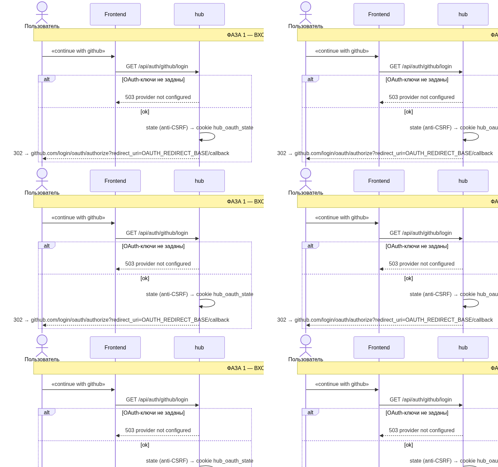
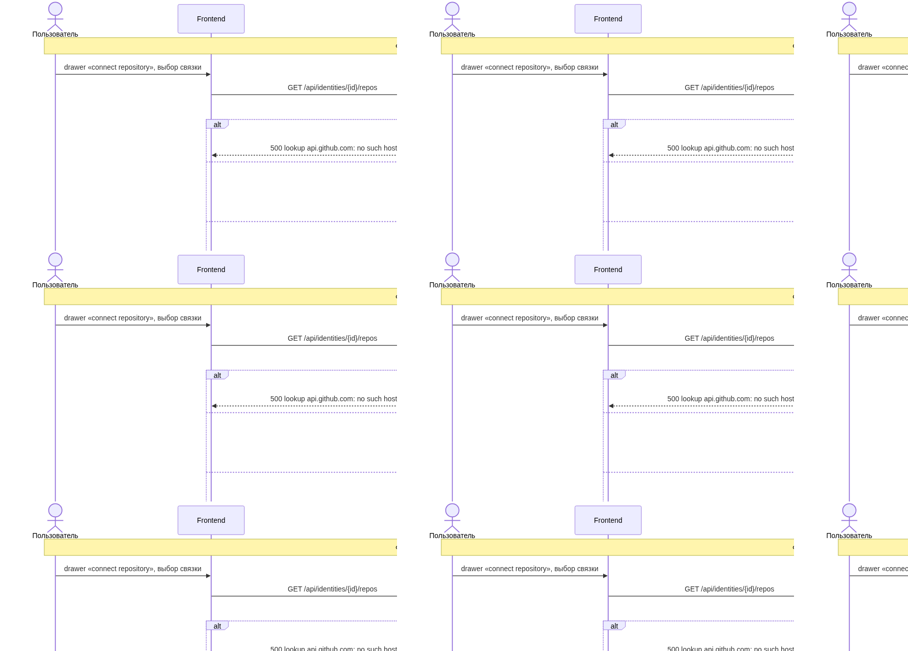
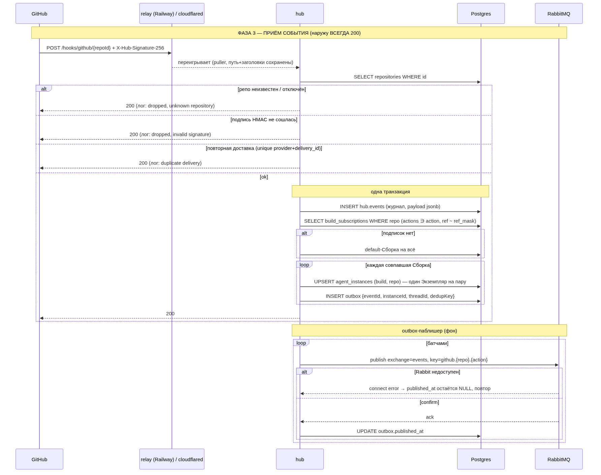
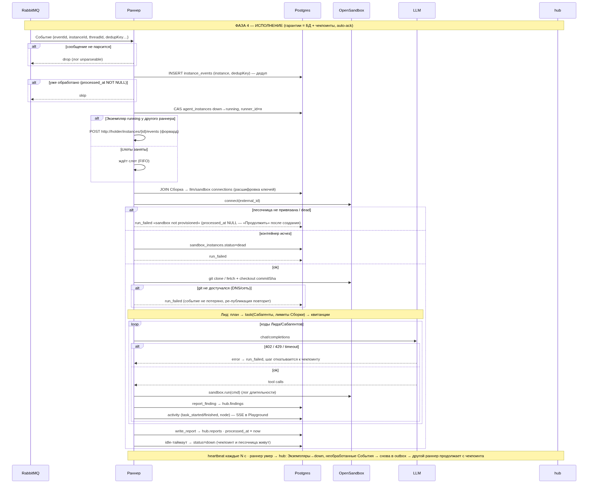
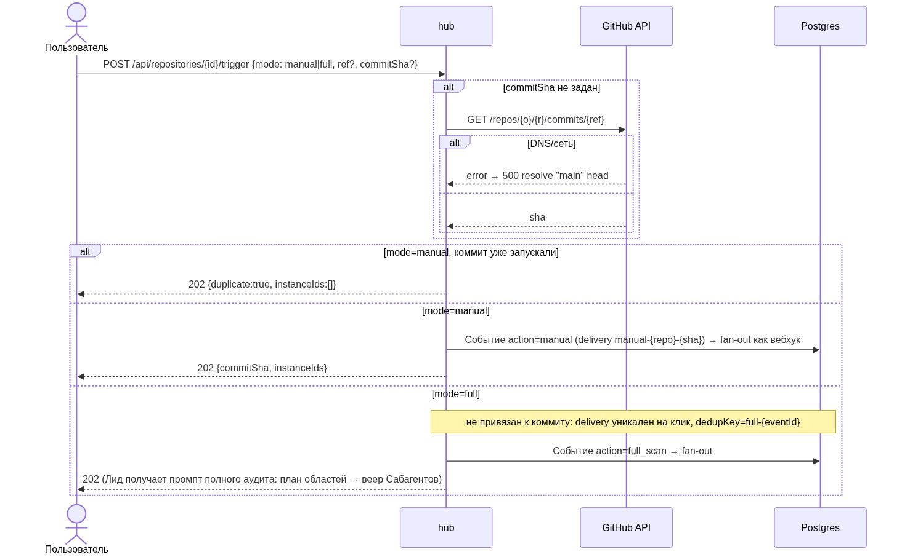
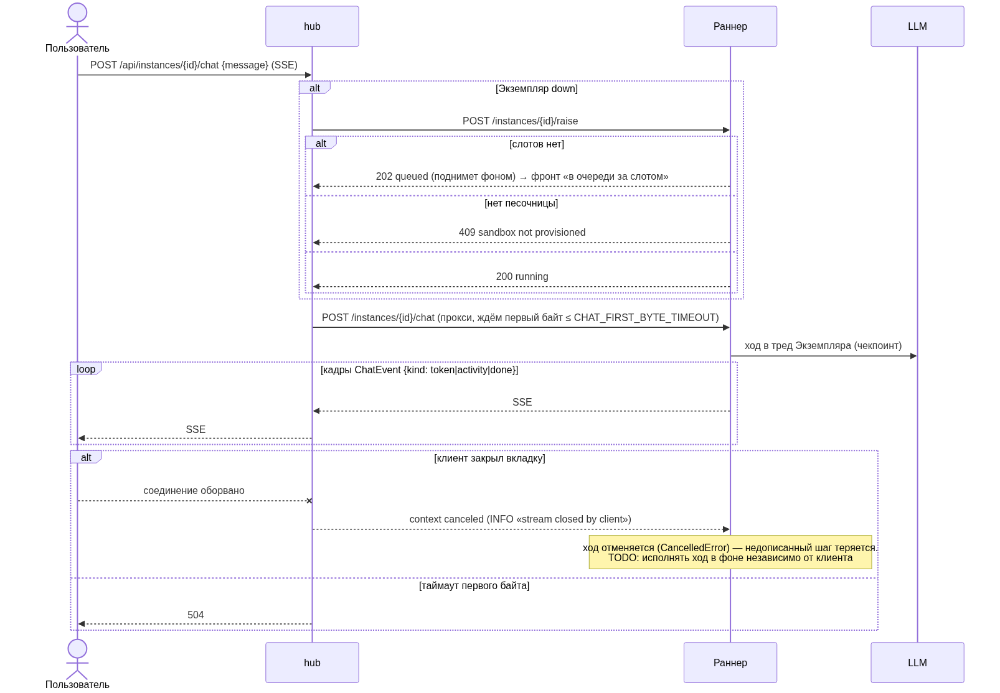
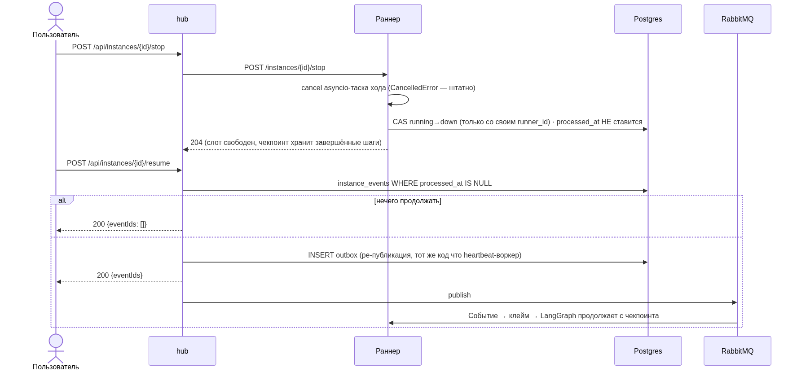
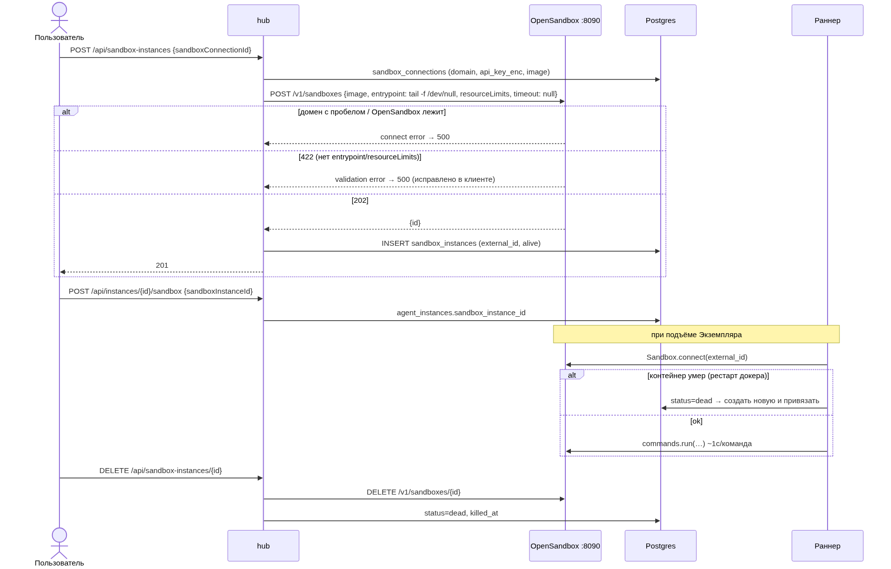
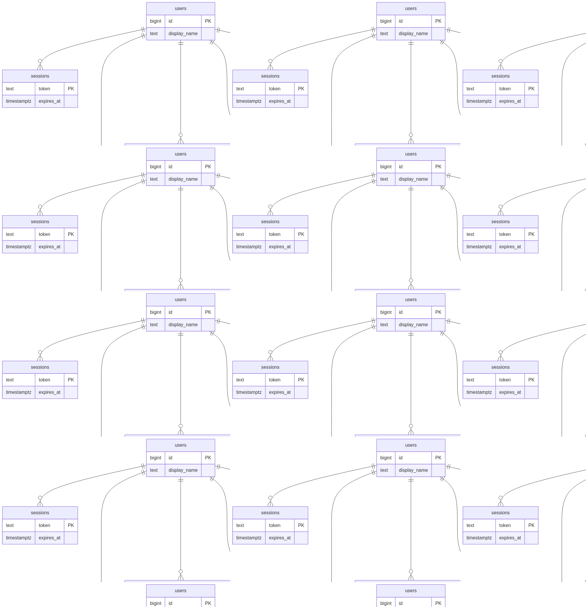

# git-agent

Агентская система безопасности для git-репозиториев: подключаешь репозиторий — на каждый пуш (или по кнопке)
поднимается **долгоживущий LLM-агент**, который в изолированной песочнице разбирает код, делегирует
проверки Сабагентам, фиксирует уязвимости и помнит репозиторий между коммитами. За ним можно наблюдать
вживую (граф Лид→Сабагенты, лента событий, находки), говорить с ним в чате и заходить в его песочницу
терминалом.

Монорепа из трёх сервисов + общая инфраструктура:

| Каталог | Что | Стек |
|---|---|---|
| `backend/` | **hub** — пользователи/OAuth, подключение репо и вебхуки, Сборки/Экземпляры, outbox → RabbitMQ, реестр раннеров, HTTP API для фронта | Go |
| `agent/` | **раннер** — консьюмер Событий, поднимает агента из Сборки, исполняет Лида с Сабагентами в песочнице, чат/терминал/activity | Python 3.13, LangGraph |
| `frontend/` | UI (repos, playground с графом/чатом/терминалом, builds, account) | React, Vite, Bun |
| `tunnel/` | relay на Railway: постоянный публичный URL для вебхуков → локальный puller | Go |
| `deploy/` | Postgres, RabbitMQ, OpenSandbox | docker compose |
| `migrations/` | SQL-миграции (`agent/`, `backend/`), единый мигратор | |

Термины проекта — [CONTEXT.md](CONTEXT.md). Решения и их история — [`.wayfinder/map.md`](.wayfinder/map.md).
Правила для агентов-разработчиков — [CLAUDE.md](CLAUDE.md).

## Как это работает

```
GitHub ──webhook──▶ relay/tunnel ──▶ hub ──outbox──▶ RabbitMQ ──▶ раннер ──▶ Лид + Сабагенты ──▶ песочница (OpenSandbox)
                                     │                                  │
                                 Postgres ◀────── findings / reports / activity / чекпоинты
                                     ▲
                                 frontend (SSE: чат, activity, терминал)
```

- **Событие** — тонкий факт с вебхука (`push`, `pull_request`, …) или ручной запуск. Без секретов.
- **Сборка Агента** — хранимое определение: LLM-подключение, sandbox-подключение, промпт, пресет памяти,
  лимиты Сабагентов. Не процесс.
- **Экземпляр Агента** — долгоживущий агент *одного репозитория* (один на Сборка+репо): свой чекпоинт-тред,
  копящий знание о репо, статус `down`/`running`. События и чат доливаются в один тред.
- **Раннер** — процесс со слотами, который клеймит Экземпляры и исполняет ходы. Гарантии — не в ack'ах
  Rabbit, а в БД + чекпоинтах: умер раннер — другой продолжит с чекпоинта.
- **Песочницу** создаёт пользователь (hub → OpenSandbox), раннер только подключается.

## Потоки (sequence-диаграммы)

Источник — [`docs/flows.md`](docs/flows.md) (Mermaid, с ветками ошибок). Пересборка PNG: `task diagrams`.

### 1. Вход через GitHub/GitLab


### 2. Подключение репозитория — hub сам ставит webhook


### 3. Вебхук → transactional outbox → RabbitMQ


### 4. Раннер: исполнение События агентом


### 5. Ручной запуск и полный скан


### 6. Чат с агентом


### 7. Остановить ход / продолжить с чекпоинта


### 8. Жизненный цикл песочницы


## Схема данных

Схема `hub.*` в Postgres — [`migrations/backend/001_init.sql`](migrations/backend/001_init.sql) и далее;
диаграмма — [`docs/ERD.md`](docs/ERD.md).



## Быстрый старт

Требования: docker, `uv`, Go 1.27, bun, `task`.

```sh
cp .env.example .env            # заполнить DATABASE_URL, SECRETS_KEY (openssl rand -hex 32), RUNNER_TOKEN, LLM_*
task up                         # Postgres :5433, RabbitMQ :5673 (UI :15673 guest/guest), OpenSandbox :8090
task install && task migrate    # окружение агента + все миграции (agent + backend)
task backend:run                # hub на :8081
task runner                     # раннер на :8082 (регистрируется в hub сам)
task front                      # UI на :5173 (vite-прокси /hub → :8081)
```

Дальше в UI: Builds → LLM-подключение и sandbox-подключение (`localhost:8090`, `dev-local-key`,
`alpine/git:latest`) → Сборка → Repositories → подключить репозиторий → создать песочницу → «Run agent».

**Вебхуки снаружи.** GitHub должен достучаться до hub: либо relay на Railway (`tunnel/`, постоянный URL,
`task relay:deploy` + `task relay:pull`), либо временный cloudflared (`task tunnel` — перезапускает туннель и
перепрописывает хуки). Адрес — `WEBHOOK_BASE_URL` в `.env`; OAuth-callback остаётся на localhost
(`OAUTH_REDIRECT_BASE`).

**Dev без OAuth.** `DEV_USER_ID=<id>` в `.env` — hub считает запросы без сессии запросами этого пользователя.
Только для разработки.

## Контракты

- HTTP hub ↔ frontend — [`backend/docs/openapi.yaml`](backend/docs/openapi.yaml) (camelCase, авторитет).
- Rabbit-сообщение и API раннера — [`.wayfinder/tickets/010-service-contracts.md`](.wayfinder/tickets/010-service-contracts.md).
- Формат SSE-кадров (чат, activity, терминал) — в openapi.yaml.

## Проверки

```sh
task check          # агент: ruff + pytest (включая Lean-верификацию модели рантайма)
task backend:test   # go test ./...
cd frontend && bun run typecheck && bun run build
```
