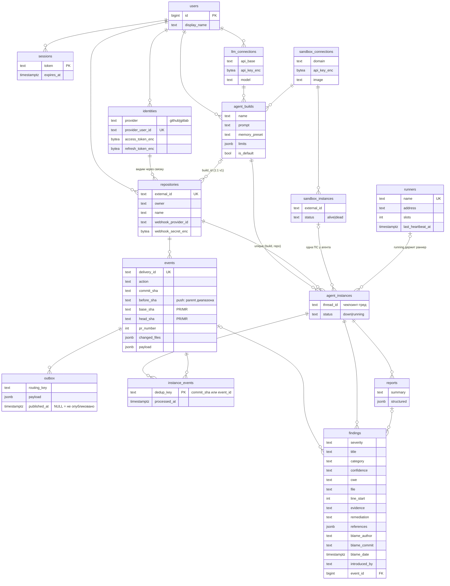

# hub — ERD (001_init.sql)

```mermaid
erDiagram
    users ||--o{ sessions : ""
    users ||--o{ identities : ""
    users ||--o{ llm_connections : ""
    users ||--o{ agent_builds : ""
    users ||--o{ repositories : ""
    identities ||--o{ repositories : "видим через связку"
    llm_connections ||--o{ agent_builds : ""
    sandbox_connections ||--o{ agent_builds : ""
    sandbox_connections ||--o{ sandbox_instances : ""
    agent_builds |o--o{ repositories : "build_id (1:1 v1)"
    repositories ||--o{ events : ""
    events ||--o{ outbox : ""
    agent_builds ||--o{ agent_instances : ""
    repositories ||--o{ agent_instances : "unique (build, repo)"
    sandbox_instances |o--o{ agent_instances : "одна ПС у агента"
    runners |o--o{ agent_instances : "running держит раннер"
    agent_instances ||--o{ instance_events : "дедуп/обработано"
    events ||--o{ instance_events : ""
    events |o--o{ findings : ""
    agent_instances ||--o{ reports : ""
    agent_instances ||--o{ findings : ""
    reports |o--o{ findings : ""

    users {
        bigint id PK
        text display_name
    }
    sessions {
        text token PK
        timestamptz expires_at
    }
    identities {
        text provider "github|gitlab"
        text provider_user_id UK
        bytea access_token_enc
        bytea refresh_token_enc
    }
    llm_connections {
        text api_base
        bytea api_key_enc
        text model
    }
    sandbox_connections {
        text domain
        bytea api_key_enc
        text image
    }
    agent_builds {
        text name
        text prompt
        text memory_preset
        jsonb limits
        bool is_default
    }
    repositories {
        text external_id UK
        text owner
        text name
        text webhook_provider_id
        bytea webhook_secret_enc
    }
    events {
        text delivery_id UK
        text action
        text commit_sha
        text before_sha "push: parent диапазона"
        text base_sha "PR/MR"
        text head_sha "PR/MR"
        int pr_number
        jsonb changed_files
        jsonb payload
    }
    outbox {
        text routing_key
        jsonb payload
        timestamptz published_at "NULL = не опубликовано"
    }
    sandbox_instances {
        text external_id
        text status "alive|dead"
    }
    agent_instances {
        text thread_id "чекпоинт-тред"
        text status "down|running"
    }
    instance_events {
        text dedup_key PK "commit_sha или event_id"
        timestamptz processed_at
    }
    runners {
        text name UK
        text address
        int slots
        timestamptz last_heartbeat_at
    }
    reports {
        text summary
        jsonb structured
    }
    findings {
        text severity
        text title
        text category
        text confidence
        text cwe
        text file
        int line_start
        text evidence
        text remediation
        jsonb references
        text blame_author
        text blame_commit
        timestamptz blame_date
        text introduced_by
        bigint event_id FK
    }
```
