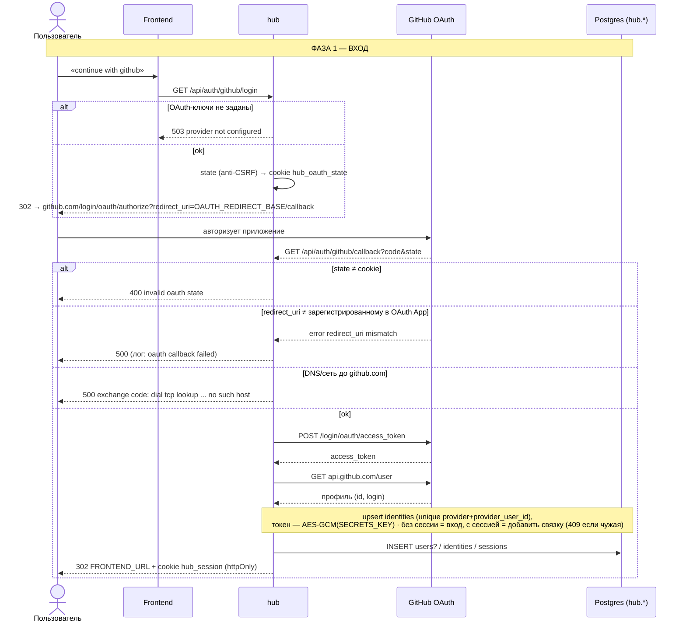
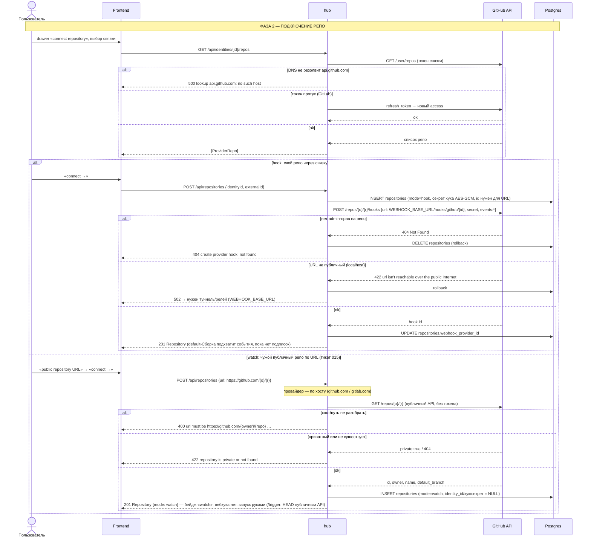
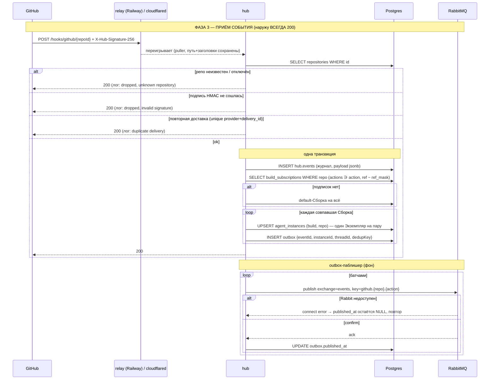
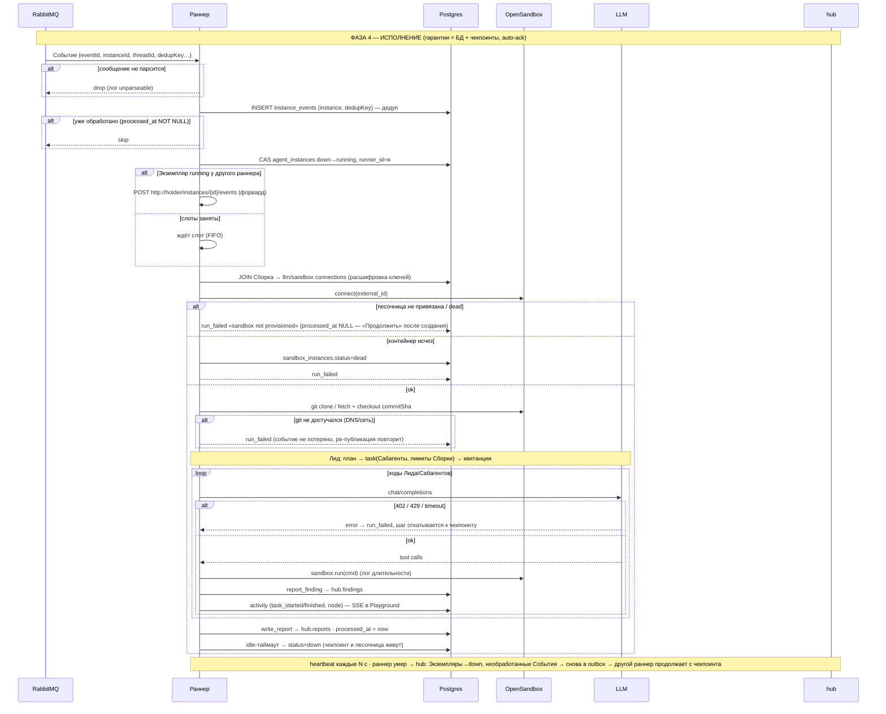
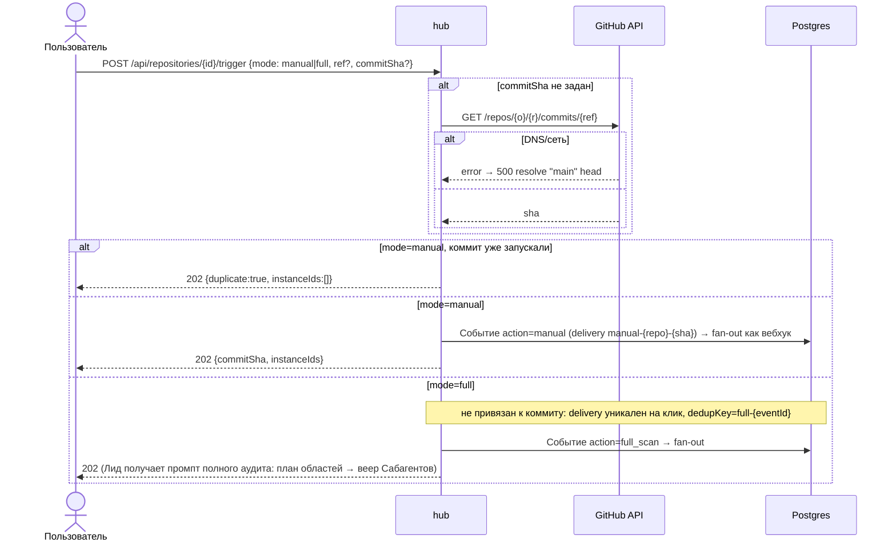
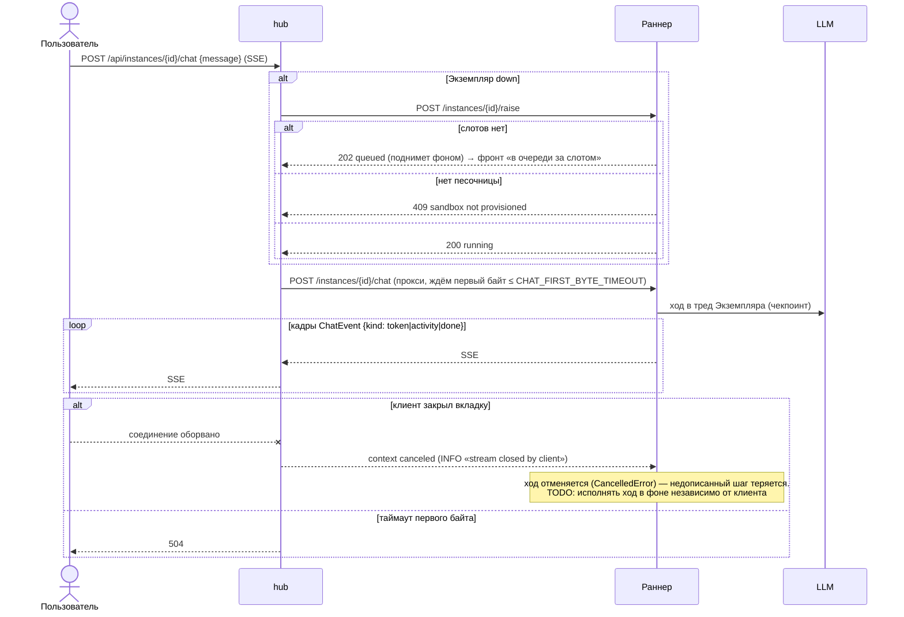
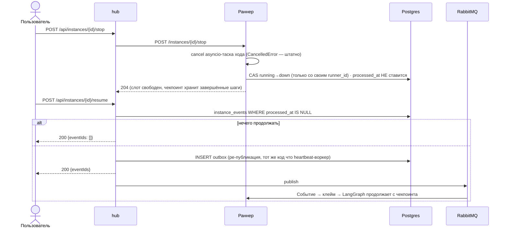

# Потоки git-agent hub — sequence-диаграммы

Каждый поток — с ветками ошибок (`alt/else`). Термины — CONTEXT.md. Рендер в PNG: `task diagrams`
(mermaid-cli). Источник правды по контрактам — `backend/docs/openapi.yaml`, тикет 010 (Rabbit/раннер).

trace_id: `X-Trace-Id` на всех HTTP-стрелках (фронт → hub → раннер/провайдер/OpenSandbox, эхо в ответе), `traceId` в Rabbit-сообщении, колонки `hub.events.trace_id` / `hub.activity.trace_id`; тот же id — поле `trace_id` в логах hub/раннера и тег `trace:<id>` в Langfuse/LangSmith.

## 1. Вход через GitHub/GitLab (OAuth)



## 2. Подключение репозитория (webhook ставит hub / watch по URL)



## 3. Вебхук → outbox → RabbitMQ (fan-out)



## 4. Раннер: обработка События агентом



## 5. Ручной запуск / полный скан



## 6. Чат с агентом и обрыв клиента



## 7. Остановить ход / продолжить



## 8. Жизненный цикл песочницы (создаёт юзер или hub при запуске, раннер только connect)

```mermaid
sequenceDiagram
    actor U as Пользователь
    participant H as hub
    participant SB as OpenSandbox :8090
    participant DB as Postgres
    participant RN as Раннер

    U->>H: POST /api/sandbox-instances {sandboxConnectionId}
    H->>DB: sandbox_connections (domain, api_key_enc, image)
    H->>SB: POST /v1/sandboxes {image, entrypoint: tail -f /dev/null, resourceLimits, timeout: null}
    alt домен с пробелом / OpenSandbox лежит
        SB-->>H: connect error → 500
    else 422 (нет entrypoint/resourceLimits)
        SB-->>H: validation error → 500 (исправлено в клиенте)
    else 202
        SB-->>H: {id}
        H->>DB: INSERT sandbox_instances (external_id, alive)
        H-->>U: 201
    end
    U->>H: POST /api/instances/{id}/sandbox {sandboxInstanceId}
    H->>DB: agent_instances.sandbox_instance_id
    Note over U,DB: запуск: /trigger (каждый затронутый Экземпляр), raise, chat
    U->>H: POST /api/repositories/{id}/trigger | /api/instances/{id}/raise | /chat
    H->>DB: Экземпляр (upsert) + статус привязанной песочницы
    alt нет живой (не привязана / dead) — hub создаёт сам
        H->>DB: agent_builds.sandbox_connection_id Сборки Экземпляра
        H->>SB: POST /v1/sandboxes (тот же путь, что ручное создание)
        alt OpenSandbox не ответил
            SB-->>H: error
            H-->>U: 502 provision sandbox for instance: … (Событие НЕ публикуется, raise не зовётся)
        else 202
            SB-->>H: {id}
            H->>DB: INSERT sandbox_instances (alive) + agent_instances.sandbox_instance_id
        end
    else живая привязана
        Note over H: вторую не создаём
    end
    H->>DB: Событие в outbox / H->>RN: raise
    Note over RN,SB: при подъёме Экземпляра
    RN->>SB: Sandbox.connect(external_id)
    alt контейнер исчез (рестарт докера), статус ещё alive
        RN-->>H: SandboxNotProvisionedError → Событие не обработано; юзер kill → dead, следующий запуск пересоздаст
    else ok
        RN->>SB: commands.run(…) ~1с/команда
    end
    U->>H: DELETE /api/sandbox-instances/{id}
    H->>SB: DELETE /v1/sandboxes/{id}
    H->>DB: status=dead, killed_at
```
